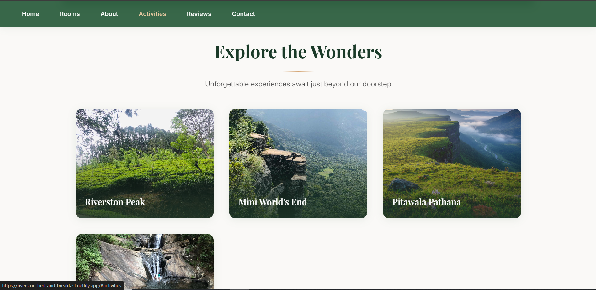

# Riverston Bed and Breakfast 🌿

A fast, SEO-optimized **static website** for a small hotel / guest house located in **Riverston, Matale, Sri Lanka**.  
This project is designed to provide a simple, elegant online presence with excellent performance and search engine visibility.

---

## 🌍 Live Website

🔗 https://riverston-bed-and-breakfast.netlify.app  

---

## 📌 About the Project

**Riverston Bed and Breakfast** is a static website built to showcase accommodation options, location details, and nearby attractions around Riverston and the Knuckles Mountain Range.

The website focuses on:
- High performance
- Local SEO optimization
- Mobile responsiveness
- Simple and clean UI

Ideal for small hotels, guest houses, and eco stays.

---

## ✨ Features

- ⚡ Fully static website (very fast loading)
- 🔍 SEO-friendly meta tags and content
- 📱 Mobile responsive layout
- 🏔 Location-focused content (Riverston, Matale, Knuckles)
- 🌐 Deployed on Netlify with free SSL
- 💸 Zero backend & low maintenance cost

---

## 🛠 Tech Stack

- **HTML5**
- **CSS3 (Vanilla CSS)**
- **Google Fonts**
- **Netlify** (Hosting & CDN)

---

## 🚀 Deployment

This site is deployed using **Netlify**.

### Steps to Deploy:
1. Clone this repository
2. Push code to GitHub
3. Go to Netlify → New Site → Import from Git
4. Select this repository
5. Deploy 🎉

---

## 🔍 SEO Considerations

- Optimized `<title>` and `<meta description>`
- Location-based keywords (Riverston, Matale)
- Fast loading speed (static HTML)
- Ready for Google Business Profile integration

---

## 📍 Location Highlights

- Riverston View Point
- Mini World’s End
- Pitawala Pathana
- Knuckles Mountain Range
- Nature trails & waterfalls

---

## 📞 Contact Information

**Riverston Bed and Breakfast**  
📍 Riverston Road, Matale, Sri Lanka  
📧 Email: riverstonbnb@email.com  
📞 Phone: +94 66 123 1244  

---

## 📄 License

This project is open-source and free to use for personal or commercial purposes.

---

## 🤝 Contributions

Suggestions and improvements are welcome.  
Feel free to fork this repository or submit a pull request.

---

## 🌱 Future Improvements

- Image gallery
- WhatsApp booking button
- Google Maps embed
- Hotel schema (JSON-LD)
- Custom domain integration

---

**Built with ❤️ for nature lovers visiting Riverston**
